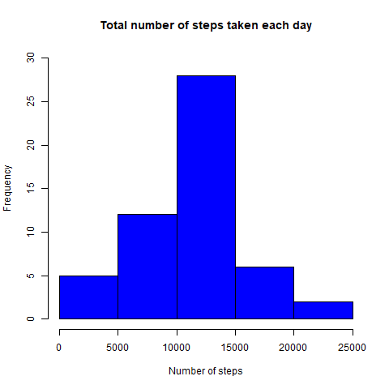

### About

This is the first project for the **Reproducible Research** course in
Coursera's Data Science specialization. This assignment makes use of
data from a personal activity monitoring device (step counter). This
device collects data at 5-minute intervals throughout the day. The data
consists of two months of data from an anonymous individual collected
during the months of October and November, 2012 and include the number
of steps taken in 5-minute intervals each day.

The data for this assignment can be downloaded from the course web site.

The variables included in this dataset are: **steps**: Number of steps
taking in a 5-minute interval (missing values are coded as `NA`)
**date**: The date on which the measurement was taken in YYYY-MM-DD
format **interval**: Identifier for the 5-minute interval in which
measurement was taken

Loading and preprocessing the data
----------------------------------

For the preparation of data, the dplyr package was used.  
Loading as the data frame and create the data frame table.

    library(dplyr)

    ## Warning: package 'dplyr' was built under R version 3.5.3

    ## 
    ## Attaching package: 'dplyr'

    ## The following objects are masked from 'package:stats':
    ## 
    ##     filter, lag

    ## The following objects are masked from 'package:base':
    ## 
    ##     intersect, setdiff, setequal, union

    activity <- read.csv("repdata_data_activity/activity.csv", stringsAsFactors = FALSE)
    activity <- tbl_df(activity)
    summary(activity)

    ##      steps            date              interval     
    ##  Min.   :  0.00   Length:17568       Min.   :   0.0  
    ##  1st Qu.:  0.00   Class :character   1st Qu.: 588.8  
    ##  Median :  0.00   Mode  :character   Median :1177.5  
    ##  Mean   : 37.38                      Mean   :1177.5  
    ##  3rd Qu.: 12.00                      3rd Qu.:1766.2  
    ##  Max.   :806.00                      Max.   :2355.0  
    ##  NA's   :2304

    activity$date <- as.Date(activity$date)

What is mean total number of steps taken per day?
-------------------------------------------------

Create the number of steps taken each day by the histogram, and
calculate the mean and the median value.

    activity_date <- group_by(activity, date)

    sum_steps <- summarise(activity_date, sum_s = sum(steps, na.rm = TRUE))
    sum_steps <- filter(sum_steps, sum_s > 0)

    hist(sum_steps$sum_s, ylim = c(0,30), col = "blue", xlab = "Number of steps", main = "Total number of steps taken each day")

The mean of the total number of steps taken per day:

    mean(sum_steps$sum_s)

    ## [1] 10766.19

The median of the total number of steps taken per day:

    median(sum_steps$sum_s)

    ## [1] 10765

What is the average daily activity pattern?
-------------------------------------------

Make a time series plot of the 5-minute interval (x-axis) and the
average number of steps taken, averaged across all days (y-axis).

    activity_interval <- group_by(activity, interval)
    mean_interval <- summarise(activity_interval, mean_i = mean(steps, na.rm = TRUE))
    mean_interval

    ## # A tibble: 288 x 2
    ##    interval mean_i
    ##       <int>  <dbl>
    ##  1        0 1.72  
    ##  2        5 0.340 
    ##  3       10 0.132 
    ##  4       15 0.151 
    ##  5       20 0.0755
    ##  6       25 2.09  
    ##  7       30 0.528 
    ##  8       35 0.868 
    ##  9       40 0     
    ## 10       45 1.47  
    ## # ... with 278 more rows

    with(mean_interval, plot(interval, mean_i, type="l", lwd = 2, col = "darkgreen", ylab = "Average number of steps", main = "Average number of steps per intervals"))

Which is 5-minute interval, on average across all the days in the
dataset, contains the maximum number of steps?

    mean_interval[which.max(mean_interval$mean_i), ]$interval

    ## [1] 835

Imputing missing values
-----------------------

The total number of missing values in the dataset:

    sum(!complete.cases(activity))

    ## [1] 2304

Creating is the new dataset that is equal to the original dataset but
with the missing data filled in. For filling NA used mean value.

    activity_mean <- mutate(activity_interval,Mean=mean(steps,na.rm=TRUE),steps=replace(steps,which(is.na(steps)),first(Mean)))

    sum_steps_noNA <- group_by(activity_mean, date)
    sum_steps_noNA <- filter(sum_steps_noNA, steps > 0)

    sum_steps_noNA1 <- summarize(sum_steps_noNA,sum_s=sum(steps)) 
    sum_steps_noNA1

    ## # A tibble: 61 x 2
    ##    date        sum_s
    ##    <date>      <dbl>
    ##  1 2012-10-01 10766.
    ##  2 2012-10-02   126 
    ##  3 2012-10-03 11352 
    ##  4 2012-10-04 12116 
    ##  5 2012-10-05 13294 
    ##  6 2012-10-06 15420 
    ##  7 2012-10-07 11015 
    ##  8 2012-10-08 10766.
    ##  9 2012-10-09 12811 
    ## 10 2012-10-10  9900 
    ## # ... with 51 more rows

    hist(sum_steps_noNA1$sum_s,ylim = c(0,40), col = "red", xlab = "Number of steps + mean imputed", main = "Total number of steps taken each day + mean imputed")
    hist(sum_steps$sum_s,ylim = c(0,40), col = "blue", add = TRUE)
    legend("topright", c("Real", "Mean-Imputed"), col=c("blue", "red"), lwd=15)

Are there differences in activity patterns between weekdays and weekends?
-------------------------------------------------------------------------

Creating the new factor variable in the dataset with two levels -
“weekday” and “weekend” indicating whether a given date is a weekday or
weekend.

    activity_weekdays <- mutate(sum_steps_noNA, weekday = weekdays(date))
    activity_weekdays$weekday[!activity_weekdays$weekday == "воскресенье" & !activity_weekdays$weekday == "суббота"] <- "Weekday"
    activity_weekdays$weekday[activity_weekdays$weekday == "воскресенье" | activity_weekdays$weekday == "суббота"] <- "Weekend"
    activity_weekdays2 <- group_by(activity_weekdays, interval, weekday)
    activity_weekdays2_sum <- summarise(activity_weekdays2, mean2 = mean(steps))

For plotting used the lattice package.

    library(lattice)
    xyplot(mean2 ~ interval | weekday, data = activity_weekdays2_sum, layout = c(1,2), type = "l", grid = TRUE, group = weekday,
           ylab = "Average number of steps", xlab = "Interval", lwd = 2, main = "Average daily steps by type of date")

